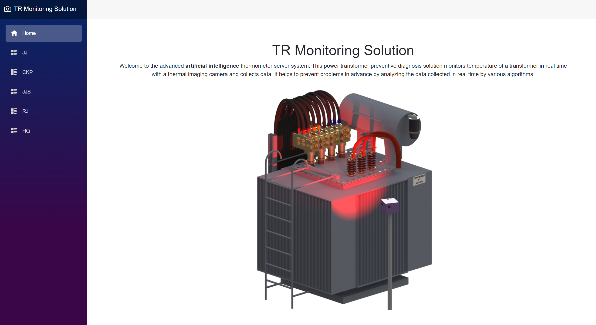
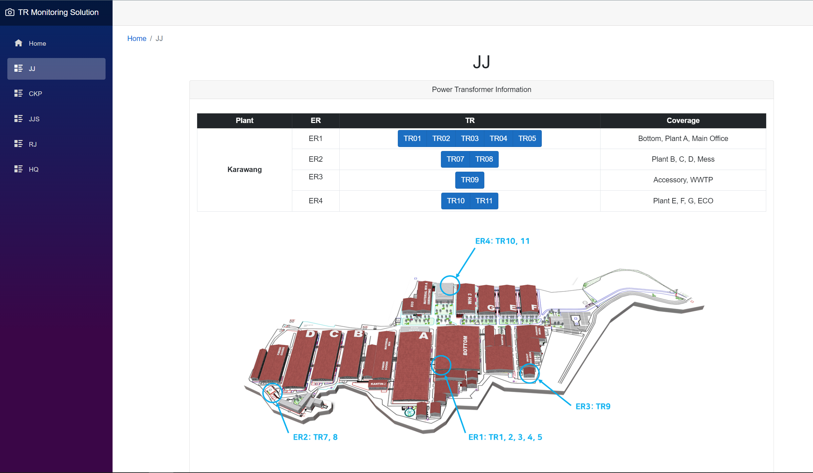
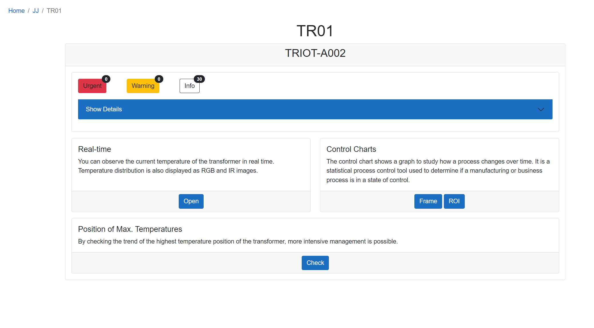
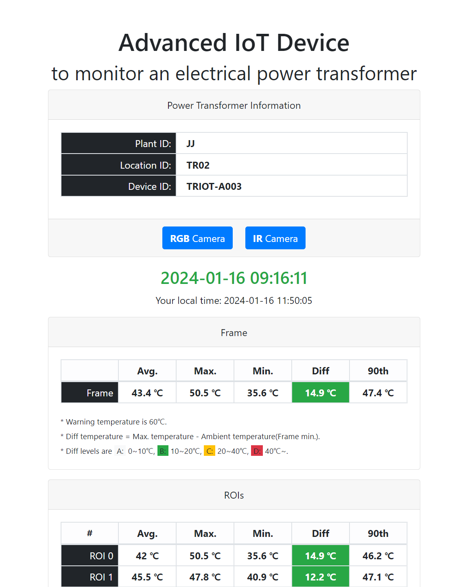
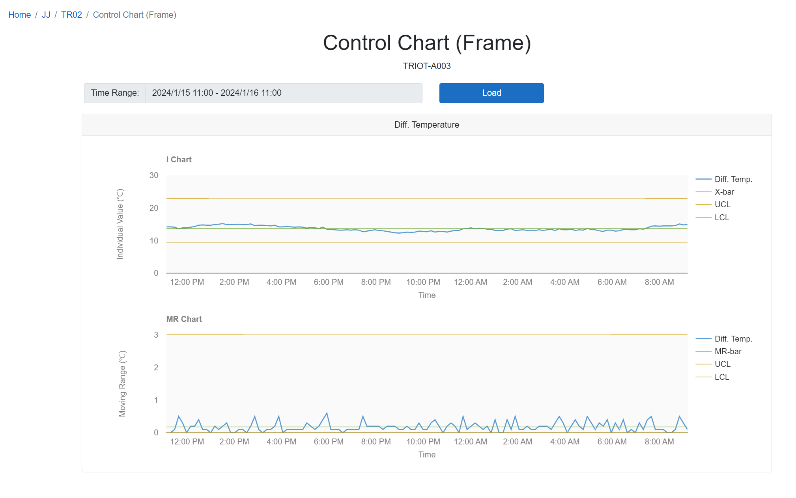
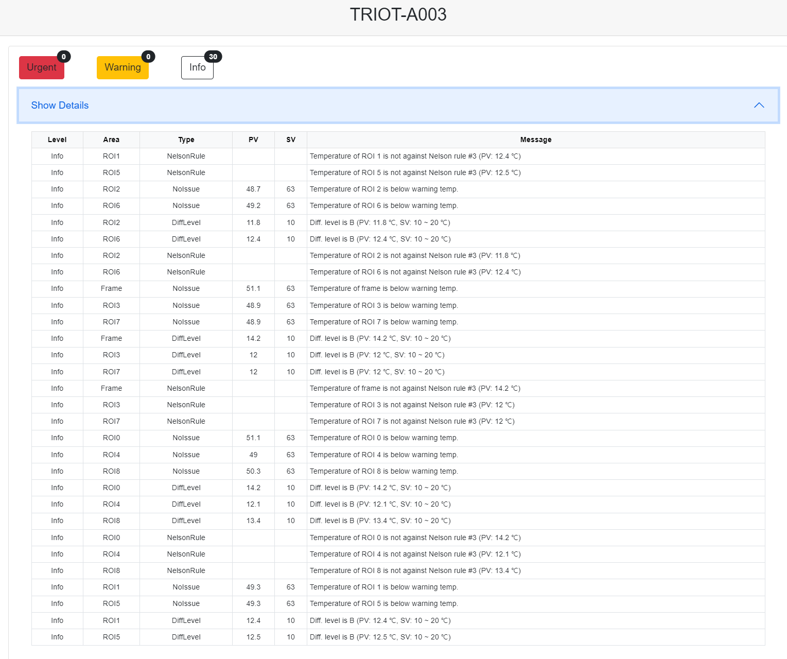
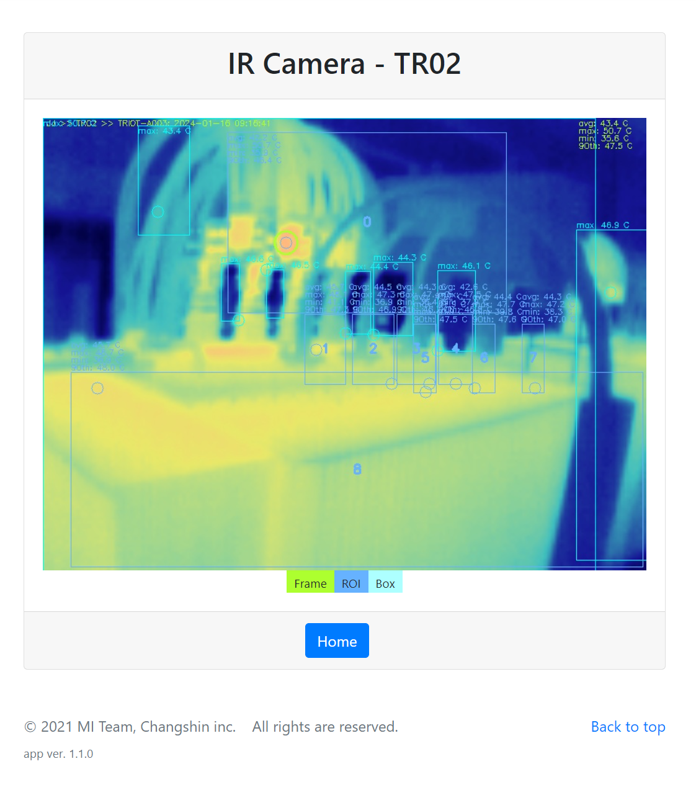

# ⚡ Enterprise Transformer Monitoring Dashboard

[](https://dotnet.microsoft.com/)
[](https://dotnet.microsoft.com/apps/aspnet)
[](https://dotnet.microsoft.com/apps/aspnet/web-apps/blazor)
[](https://docs.microsoft.com/ef/core/)
[](https://www.postgresql.org/)
[](https://dotnet.microsoft.com/apps/aspnet/signalr)
[](https://www.docker.com/)

Real-time transformer monitoring and anomaly detection solution built with ASP.NET Core, Blazor, and SignalR for industrial power systems management.

## 📖 **Overview**

Enterprise-grade transformer monitoring solution that provides real-time status monitoring, automated anomaly detection, and intelligent alerting for industrial power systems. Built with modern .NET technologies for scalable and reliable power infrastructure management.

## 🏗️ **Architecture**

```text
┌─────────────────────────────────────────────────────────────┐
│                    Industrial Field                         │
├─────────────────┬─────────────────┬─────────────────────────┤
│  Transformers   │ Thermal Cameras │      IoT Sensors        │
│                 │                 │                         │
│ • Temperature   │ • Heat Images   │ • Status Monitoring     │
│ • Load Current  │ • Thermal Maps  │ • Auto Diagnostics      │
└─────────────────┴─────────────────┴─────────────────────────┘
                            │
                            ▼
┌─────────────────────────────────────────────────────────────┐
│                 Data Collection Layer                       │
├─────────────────────────────────────────────────────────────┤
│ • MQTT Broker          • Data Import Service                │
│ • Real-time Ingestion  • Background Processing              │
└─────────────────────────────────────────────────────────────┘
                            │
                            ▼
┌─────────────────────────────────────────────────────────────┐
│              ASP.NET Core Application Stack                 │
├─────────────────────────────────────────────────────────────┤
│ • Blazor Dashboard     • MVC Web App                        │
│ • SignalR Hub         • RESTful API                         │
│ • Business Logic      • Alert Engine                        │
└─────────────────────────────────────────────────────────────┘
                            │
                            ▼
┌─────────────────────────────────────────────────────────────┐
│                   Data Storage Layer                        │
├─────────────────────────────────────────────────────────────┤
│ • PostgreSQL Database  • Redis Cache                        │
│ • Time-series Data    • Session Storage                     │
└─────────────────────────────────────────────────────────────┘
```

## ⚡ **Key Features**

### 🌡️ **Real-time Monitoring**

- **Temperature Tracking**: Continuous transformer temperature monitoring
- **Load Analysis**: Real-time electrical load and current measurements
- **Status Dashboard**: Live operational status with historical trends
- **Multi-site Support**: Enterprise and location-specific dashboards

### 🚨 **Intelligent Alerting**

- **Smart Notifications**: Automated email/SMS alerts for anomaly detection
- **Threshold Management**: Configurable alert thresholds and escalation rules
- **Multi-channel Alerts**: Email, SMS, and dashboard notifications
- **Alert Correlation**: AI-powered pattern recognition for predictive maintenance

### 📊 **Advanced Analytics**

- **Trend Analysis**: Historical data analysis and performance trending
- **Thermal Integration**: Thermal camera data fusion and analysis
- **Predictive Maintenance**: AI-based anomaly prediction and early warning
- **Custom Reports**: Automated reporting and data export capabilities

### 🔧 **Device Management**

- **IoT Device Control**: Automatic device rebooting and health management
- **Remote Diagnostics**: Real-time device status and troubleshooting
- **Firmware Updates**: Over-the-air firmware management
- **Network Monitoring**: Device connectivity and communication health

## 🛠️ **Technology Stack**

### **💻 Backend Technologies**

| Component | Technology | Purpose |
| ------ | ------ | ------ |
| **Framework** | .NET 6.0 | Core application framework |
| **Web Framework** | ASP.NET Core MVC | Web application and API |
| **UI Framework** | Blazor Server | Interactive real-time dashboard |
| **ORM** | Entity Framework Core | Database access and migrations |
| **Real-time** | SignalR | Live data streaming and notifications |
| **Background Services** | Hosted Services | Data processing and device management |

### **🎨 Frontend Technologies**

| Component | Technology | Purpose |
| ------ | ------ | ------ |
| **UI Components** | Blazor Components | Interactive dashboard elements |
| **Styling** | Bootstrap 5 | Responsive design system |
| **Charts** | Chart.js | Data visualization and analytics |
| **3D Views** | Three.js | 3D transformer monitoring displays |
| **Icons** | Font Awesome | Professional iconography |

### **🗄️ Data & Storage**

| Component | Technology | Purpose |
| ------ | ------ | ------ |
| **Primary Database** | PostgreSQL 12+ | Transactional data and configuration |
| **Caching** | Redis | Session storage and performance optimization |
| **File Storage** | Local/Cloud Storage | Thermal images and reports |

### **🐳 Infrastructure & DevOps**

| Component | Technology | Purpose |
| ------ | ------ | ------ |
| **Containerization** | Docker | Application packaging and deployment |
| **Reverse Proxy** | Nginx | Load balancing and SSL termination |
| **Process Manager** | SystemD | Service lifecycle management |
| **Monitoring** | Health Checks | Application health monitoring |

## 🖥️ **User Interface Screenshots**

### **📊 Main Dashboard - TrMontrgSrv.Web**

Comprehensive transformer monitoring web solution with real-time data visualization and alerting.


*Main monitoring dashboard with live transformer status and system overview*

### **📋 Monitoring Views**


*Site layout and transformer location overview*


*Detailed device information and configuration panel*


*Comprehensive device status and operational parameters*

### **📈 Analytics & Visualization**


*Real-time performance charts and historical trend analysis*


*Alert management and issue tracking interface*


*Thermal camera integration with heat map visualization*

### **⚡ Interactive Dashboard - TrMontrgSrv.Dashboard**

Blazor-powered real-time interactive dashboard with SignalR integration for live data updates.

## 🚀 **Quick Start**

### **📋 Prerequisites**

- **.NET 6.0 SDK** or later
- **PostgreSQL 12+** database server  
- **Redis** server for caching and sessions
- **Visual Studio 2022** or **VS Code** with C# extension

### **📦 Installation & Setup**

#### **1. Clone Repository**

```bash
git clone https://github.com/codingnanyong/tr-montrg.git
cd tr-montrg
```

#### **2. Database Configuration**

Update connection strings in `appsettings.json`:

```json
{
  "ConnectionStrings": {
    "TrMontrgSrv": "Host=localhost;Port=5432;Database=tr_montrg_srv;Username=your_user;Password=your_password",
    "TrMontrgSrvIdentity": "Host=localhost;Port=5432;Database=mi_identity;Username=your_user;Password=your_password"
  }
}
```

#### **3. Install Dependencies**

```bash
# Restore NuGet packages
dotnet restore

# Build solution
dotnet build
```

#### **4. Database Migration**

```bash
# Apply Entity Framework migrations
dotnet ef database update --project TrMontrgSrv.EF

# Verify database creation
dotnet ef database update --verbose --project TrMontrgSrv.EF
```

#### **5. Run Applications**

**Multi-Application Startup:**

```bash
# Terminal 1: Web Application (MVC)
dotnet run --project TrMontrgSrv.Web
# Access: http://localhost:5000

# Terminal 2: Interactive Dashboard (Blazor)
dotnet run --project TrMontrgSrv.Dashboard
# Access: http://localhost:5001

# Terminal 3: REST API
dotnet run --project TrMontrgSrv.WebApi
# Access: http://localhost:7010
```

**Single Command Startup (Development):**

```bash
# Start all services simultaneously
dotnet run --project TrMontrgSrv.Web &
dotnet run --project TrMontrgSrv.Dashboard &
dotnet run --project TrMontrgSrv.WebApi &
```

### **🔧 Configuration**

#### **Complete appsettings.json Template**

```json
{
  "ConnectionStrings": {
    "TrMontrgSrv": "Host=localhost;Port=5432;Database=tr_montrg_srv;Username=postgres;Password=your_password",
    "TrMontrgSrvIdentity": "Host=localhost;Port=5432;Database=mi_identity;Username=postgres;Password=your_password"
  },
  "Redis": {
    "ConnectionString": "localhost:6379",
    "Database": 0,
    "Timeout": 5000
  },
  "Email": {
    "SmtpHost": "smtp.gmail.com",
    "SmtpPort": 587,
    "Username": "your_email@gmail.com",
    "Password": "your_app_password",
    "EnableSsl": true,
    "From": "TR Monitoring System <noreply@yourcompany.com>"
  },
  "IoT": {
    "MqttBroker": "localhost:1883",
    "DeviceTimeout": 30000,
    "HeartbeatInterval": 60000,
    "MaxRetries": 3
  },
  "Kestrel": {
    "EndPoints": {
      "Http": {
        "Url": "http://0.0.0.0:7010"
      }
    }
  },
  "Logging": {
    "LogLevel": {
      "Default": "Information",
      "Microsoft.AspNetCore": "Warning",
      "TrMontrgSrv": "Debug"
    }
  },
  "AllowedHosts": "*"
}
```

#### **Environment Variables (Production)**

```bash
# Database Configuration
export TR_DB_HOST=your_postgres_host
export TR_DB_PASSWORD=your_secure_password

# Redis Configuration  
export REDIS_CONNECTION_STRING=your_redis_host:6379

# Email Configuration
export SMTP_PASSWORD=your_smtp_password

# IoT Configuration
export MQTT_BROKER=your_mqtt_broker_host
```

## 🏗️ **Project Architecture**

### **📁 Solution Structure**

```text
tr-montrg/
├── 🌐 TrMontrgSrv.Web/              # ASP.NET Core MVC Web Application
│   ├── Controllers/                 # MVC controllers for web interface
│   ├── Views/                       # Razor views and layouts
│   └── wwwroot/                     # Static assets (CSS, JS, images)
├── 🔌 TrMontrgSrv.WebApi/           # RESTful Web API
│   ├── Controllers/                 # API controllers
│   ├── Infrastructure/              # API infrastructure and middleware
│   └── Core/                        # API-specific business logic
├── 📊 TrMontrgSrv.Dashboard/        # Blazor Interactive Dashboard  
│   ├── Components/                  # Blazor components
│   ├── Pages/                       # Dashboard pages
│   └── Services/                    # Client-side services
├── 💼 TrMontrgSrv.BLL/              # Business Logic Layer
│   ├── Services/                    # Business services
│   ├── Interfaces/                  # Service contracts
│   └── Processors/                  # Data processing logic
├── 🗄️ TrMontrgSrv.EF/               # Entity Framework Core + Migrations
│   ├── Contexts/                    # Database contexts
│   ├── Entities/                    # Entity models
│   └── Migrations/                  # Database migrations
├── 📋 TrMontrgSrv.Model/            # Data Models & DTOs
│   ├── Entities/                    # Domain entities
│   └── DTOs/                        # Data transfer objects
├── 🔧 TrMontrgSrv.SL/               # Service Layer
│   └── Interfaces/                  # Service layer contracts
├── 🤖 TrMontrgSrv.AutoBtg/          # Auto Batch Generator Service
│   └── Services/                    # Background processing services
├── 🛠️ TrMontrgSrv.Helpers/          # Utility Helpers
│   └── Extensions/                  # Extension methods and utilities
├── 📝 TrMontrgSrv.LoggerService/    # Logging Infrastructure
│   └── Interfaces/                  # Logging contracts
├── 📥 TrDataImporterSvc/            # Data Import Background Service
│   └── Services/                    # Import processing services
├── 🧪 TrMontrgSrv.EF.Test/          # Unit & Integration Tests
│   └── Controllers/                 # Test suites
└── 📁 TrMontrgSrv.sln               # Visual Studio Solution File
```

### **🔄 System Architecture**

```text
┌─────────────────────────────────────────────────────────────┐
│                    Presentation Layer                       │
├─────────────────┬─────────────────┬─────────────────────────┤
│   Web Client    │   Dashboard     │    Mobile App           │
│   (MVC)         │   (Blazor)      │    (Future)             │
│                 │                 │                         │
│ • Device Config │ • Real-time UI  │ • Push Notifications    │
│ • User Mgmt     │ • Live Charts   │ • Offline Capability    │
│ • Reports       │ • Alerts        │ • Remote Monitoring     │
└─────────────────┴─────────────────┴─────────────────────────┘
                            │
                            ▼
┌─────────────────────────────────────────────────────────────┐
│                   Application Layer                         │
├─────────────────────────────────────────────────────────────┤
│ • ASP.NET Core Web API    • SignalR Real-time Hubs          │
│ • Business Logic Layer    • Background Services             │
│ • Authentication/Authorization • Caching & Performance      │
└─────────────────────────────────────────────────────────────┘
                            │
                            ▼
┌─────────────────────────────────────────────────────────────┐
│                     Data Access Layer                       │
├─────────────────────────────────────────────────────────────┤
│ • Entity Framework Core   • Repository Pattern              │
│ • Database Context        • Unit of Work                    │
│ • Migration Management    • Query Optimization              │
└─────────────────────────────────────────────────────────────┘
                            │
                            ▼
┌─────────────────────────────────────────────────────────────┐
│                   Infrastructure Layer                      │
├─────────────────┬─────────────────┬─────────────────────────┤
│   PostgreSQL    │      Redis      │     MQTT Broker         │
│   Database      │     Cache       │                         │
│                 │                 │                         │
│ • Transactional │ • Session Store │ • IoT Communication     │
│ • Time-series   │ • Performance   │ • Device Management     │
│ • Reporting     │ • Real-time     │ • Data Streaming        │
└─────────────────┴─────────────────┴─────────────────────────┘
```

## 📡 **REST API Endpoints**

### **🌡️ Temperature Monitoring**

| Method | Endpoint | Description | Response |
| ------ | ------ | ------ | ------ |
| **GET** | `/api/v1/temperatures` | Retrieve temperature readings | JSON array of temperature data |
| **POST** | `/api/v1/temperatures` | Submit new temperature data | Created temperature record |
| **GET** | `/api/v1/temperatures/{deviceId}` | Get device-specific temperature data | Device temperature history |
| **GET** | `/api/v1/temperatures/alerts` | List temperature-based alerts | Active and historical alerts |

### **📊 Device Management**

| Method | Endpoint | Description | Response |
| ------ | ------ | ------ | ------ |
| **GET** | `/api/v1/devices` | List all monitored devices | JSON array of device information |
| **POST** | `/api/v1/devices` | Register new monitoring device | Created device record |
| **PUT** | `/api/v1/devices/{id}` | Update device configuration | Updated device information |
| **DELETE** | `/api/v1/devices/{id}` | Remove device from monitoring | Deletion confirmation |
| **POST** | `/api/v1/devices/{id}/reboot` | Remotely reboot IoT device | Reboot status and result |

### **📈 Analytics & Reporting**

| Method | Endpoint | Description | Response |
| ------ | ------ | ------ | ------ |
| **GET** | `/api/v1/analytics/dashboard` | Dashboard summary data | Real-time metrics and KPIs |
| **GET** | `/api/v1/analytics/trends` | Historical trend analysis | Statistical trend data |
| **GET** | `/api/v1/analytics/reports` | Generate custom reports | PDF/Excel report files |
| **GET** | `/api/v1/analytics/health` | System health metrics | System performance data |

### **🔔 Alert Management**

| Method | Endpoint | Description | Response |
| ------ | ------ | ------ | ------ |
| **GET** | `/api/v1/alerts` | List all system alerts | JSON array of alerts |
| **POST** | `/api/v1/alerts/acknowledge` | Acknowledge alert notification | Acknowledgment confirmation |
| **GET** | `/api/v1/alerts/rules` | Get alert rule configuration | Alert threshold settings |
| **PUT** | `/api/v1/alerts/rules/{id}` | Update alert thresholds | Updated rule configuration |

### **📋 API Response Format**

```json
{
  "success": true,
  "data": {
    "deviceId": "TR001",
    "temperature": 65.5,
    "timestamp": "2024-02-02T10:30:00Z",
    "status": "normal"
  },
  "message": "Temperature data retrieved successfully",
  "errors": []
}
```

## 🧪 **Testing**

### **Unit Testing**

```bash
# Run all tests
dotnet test

# Run specific project tests
dotnet test TrMontrgSrv.EF.Test

# Include code coverage
dotnet test --collect:"XPlat Code Coverage"

# Generate detailed coverage report
dotnet test --collect:"XPlat Code Coverage" --results-directory TestResults
```

### **Integration Testing**

```bash
# API integration tests
dotnet test TrMontrgSrv.WebApi.Test

# Database integration tests
dotnet test TrMontrgSrv.EF.Test

# End-to-end testing
dotnet test --filter Category=Integration
```

### **Performance Testing**

```bash
# Load testing with NBomber
dotnet run --project TrMontrgSrv.LoadTest

# Memory profiling
dotnet run --project TrMontrgSrv.PerformanceAnalyzer
```

## 🐳 **Docker Deployment**

### **Build Images**

```bash
# Build web application image
docker build -t tr-montrg-web -f TrMontrgSrv.Web/Dockerfile .

# Build API service image
docker build -t tr-montrg-api -f TrMontrgSrv.WebApi/Dockerfile .

# Build dashboard image
docker build -t tr-montrg-dashboard -f TrMontrgSrv.Dashboard/Dockerfile .
```

### **Docker Compose Deployment**

```bash
# Start complete stack
docker-compose up -d

# Scale services
docker-compose up -d --scale tr-montrg-api=3

# View logs
docker-compose logs -f tr-montrg-api
```

### **Production Deployment**

```bash
# Production environment
docker-compose -f docker-compose.prod.yml up -d

# With external database
docker-compose -f docker-compose.prod.yml -f docker-compose.db.yml up -d
```

## 📊 **Monitoring & Observability**

### **Logging Configuration**

```json
{
  "Logging": {
    "LogLevel": {
      "Default": "Information",
      "Microsoft.AspNetCore": "Warning", 
      "TrMontrgSrv": "Debug",
      "System.Net.Http.HttpClient": "Warning"
    },
    "Console": {
      "LogLevel": {
        "Default": "Information"
      }
    },
    "EventLog": {
      "LogLevel": {
        "Default": "Warning"
      }
    }
  }
}
```

### **Health Check Endpoints**

| Endpoint | Purpose | Response |
| ------ | ------ | ------ |
| `GET /health` | Overall application health | Health status summary |
| `GET /api/health` | API service health check | Service availability |
| `GET /api/health/database` | Database connectivity | PostgreSQL connection status |
| `GET /api/health/redis` | Cache service health | Redis connectivity |
| `GET /api/health/mqtt` | IoT broker connectivity | MQTT broker status |

### **Metrics & Performance**

- **Application Insights**: Performance monitoring and analytics
- **Prometheus Metrics**: Custom metrics for monitoring
- **SignalR Monitoring**: Real-time connection tracking
- **Database Performance**: Query performance and optimization

## 🔒 **Security Features**

### **Authentication & Authorization**

- ✅ **JWT Token Authentication**: Secure stateless authentication
- ✅ **Role-based Access Control**: Granular permission management
- ✅ **Multi-factor Authentication**: Enhanced security for admin users
- ✅ **Session Management**: Secure session handling with Redis

### **Application Security**

- ✅ **HTTPS Enforcement**: SSL/TLS encryption for all communications
- ✅ **CORS Policy**: Cross-origin request protection
- ✅ **SQL Injection Protection**: Parameterized queries and ORM safety
- ✅ **XSS Protection**: Input validation and output encoding
- ✅ **CSRF Protection**: Anti-forgery token validation

### **Infrastructure Security**

- ✅ **Network Segmentation**: Isolated network zones for services
- ✅ **Container Security**: Secure Docker image configurations
- ✅ **Database Security**: Encrypted connections and user isolation
- ✅ **API Rate Limiting**: DDoS protection and abuse prevention

## 🚨 **Troubleshooting**

### **Common Issues**

#### **Database Connection Errors**

```bash
# Check PostgreSQL service status (Linux)
sudo systemctl status postgresql

# Check PostgreSQL service status (Windows)
net start postgresql-x64-12

# Verify database connectivity
dotnet ef database update --verbose --project TrMontrgSrv.EF

# Test connection string
psql -h localhost -U postgres -d tr_montrg_srv
```

#### **Port Conflicts**

```bash
# Check ports in use (Linux/macOS)
netstat -tulpn | grep :5000
lsof -i :5000

# Check ports in use (Windows)
netstat -ano | findstr :5000
```

#### **SignalR Connection Issues**

```bash
# Check WebSocket support
curl -I -N -H "Connection: Upgrade" -H "Upgrade: websocket" http://localhost:5000/monitoringHub

# Verify CORS settings for SignalR
# Update appsettings.json with correct origins
```

#### **Redis Cache Problems**

```bash
# Test Redis connectivity
redis-cli ping

# Check Redis configuration
redis-cli info

# Clear cache if needed
redis-cli flushall
```

## 🤝 **Contributing**

Contributions, issues, and feature requests are welcome!

### **Development Workflow**

1. **Fork the repository**
2. **Create feature branch**: `git checkout -b feature/amazing-feature`
3. **Make changes**: Follow coding standards and add tests
4. **Commit changes**: `git commit -m 'Add amazing feature'`
5. **Push to branch**: `git push origin feature/amazing-feature`
6. **Create Pull Request**: Include detailed description and screenshots

### **Development Guidelines**

#### **Code Standards**

- ✅ **EditorConfig**: Follow project formatting rules
- ✅ **StyleCop**: Adhere to C# coding conventions  
- ✅ **Code Analysis**: Fix all compiler warnings
- ✅ **Performance**: Optimize database queries and async operations

#### **Testing Requirements**

- ✅ **Unit Tests**: Minimum 80% code coverage required
- ✅ **Integration Tests**: Test API endpoints and database operations
- ✅ **Load Testing**: Performance tests for critical paths

#### **Documentation**

- ✅ **XML Comments**: Document all public APIs
- ✅ **README Updates**: Update documentation for new features
- ✅ **API Documentation**: Update OpenAPI specifications

### **Commit Message Format**

Follow [Conventional Commits](https://www.conventionalcommits.org/) specification:

```
feat: add temperature alert thresholds
fix: resolve SignalR connection timeout
docs: update API documentation
test: add unit tests for device service
```

## 📞 **Support & Community**

- **🐛 Bug Reports**: [GitHub Issues](https://github.com/codingnanyong/tr-montrg/issues)
- **💬 Discussions**: [GitHub Discussions](https://github.com/codingnanyong/tr-montrg/discussions)
- **📧 Email**: [codingnanyong@gmail.com](mailto:codingnanyong@gmail.com)

## 📋 **Roadmap**

### **2024 Development Plan**

- **Q2 2024**
  - [ ] **AI-powered Predictive Analytics**: Machine learning for failure prediction
  - [ ] **Advanced Alerting**: Multi-level escalation and smart notifications

- **Q3 2024**

  - [ ] **Mobile Application**: Native iOS/Android apps for remote monitoring
  - [ ] **Cloud Integration**: Azure/AWS deployment support

- **Q4 2024**

  - [ ] **Multi-tenant Architecture**: Support for multiple organizations
  - [ ] **Enhanced Security**: Advanced authentication and authorization

### **2025 Vision**

- [ ] **Internationalization**: Multi-language support (Korean, English, Chinese)
- [ ] **Edge Computing**: Local processing and edge analytics
- [ ] **IoT Platform Integration**: Support for additional IoT protocols

## 💡 **Use Cases**

✅ **Power Grid Monitoring** - Real-time transformer health tracking  
✅ **Predictive Maintenance** - AI-powered failure prediction and prevention  
✅ **Industrial Safety** - Automated safety monitoring and emergency response  
✅ **Energy Efficiency** - Power consumption optimization and load management  
✅ **Compliance Reporting** - Automated regulatory compliance and documentation  
✅ **Remote Operations** - Multi-site monitoring and centralized control  

## 🏆 **Production Stats**

- **Real-time Monitoring**: 24/7 transformer health tracking
- **Multi-site Support**: Enterprise and location-specific dashboards
- **High Availability**: 99.9% uptime with redundant systems
- **Scalable Architecture**: Supports hundreds of concurrent devices
- **Enterprise Security**: Role-based access control and audit trails

## 📄 **License**

This project is licensed under the MIT License. See [LICENSE](./LICENSE) for details.

---

**⚡ Enterprise Industrial Monitoring at Scale**  
Built with ❤️ for power infrastructure reliability and safety.
